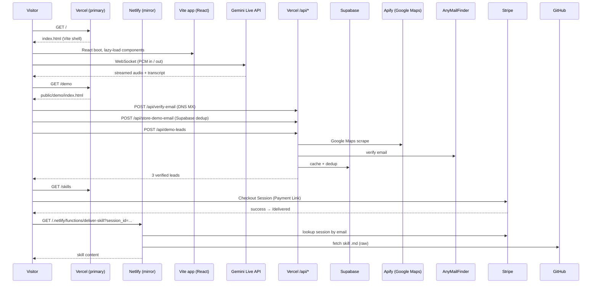

# Architecture

Tedca.org is a Vite app that hosts a live voice agent at `/`, plus five
co-located static surfaces (`/demo`, `/skills`, `/delivered`, `/blog/*`,
`/audits/*`) served by Vercel rewrites. Eight serverless functions across
Vercel and Netlify power the interactive flows.

This document covers how the pieces fit, where state lives, and which
deploy target is responsible for which surface.

---

## Overview



---

## Subsystems

### 1. Voice receptionist demo (the React app)

`App.tsx` is a state machine over `AppState`:
`IDLE → CONFIGURING → CONNECTING → ACTIVE → ENDED`.

`services/geminiLive.ts` owns the live connection:
- Opens a Gemini Live WebSocket via `@google/genai`.
- Mic capture: `getUserMedia` → `ScriptProcessorNode` → PCM frames →
  base64 → socket.
- Playback: receives Live API audio events → `decodeAudioData` →
  `AudioBufferSourceNode` chain so concatenated chunks play gap-free.
- Tracks `connectStartTime`, audio-chunk gap timestamps, and
  `currentQuality` (`good` / `fair` / `poor`).
- Caps session at 5 min with a 4-min warning callback.
- Up to 2 reconnect attempts on socket drop.

Public callbacks for the UI to subscribe to:
`onVolumeChange`, `onDisconnect`, `onTranscript`, `onTimeout`, `onReconnecting`.

### 2. Lead-gen demo (static page + 4 API routes)

`/demo` is `public/demo/index.html` — pure HTML + inline JS — wired to four
Vercel functions:

| Route | Role |
|---|---|
| `POST /api/verify-email` | DNS MX lookup. Returns `{ valid, reason }`. |
| `POST /api/store-demo-email` | Insert into Supabase `demo_users`. Enforces per-email + per-IP rate limit. |
| `POST /api/demo-leads` | Apify Google Maps scrape → AnyMailFinder verification → returns top 3 leads. |
| `POST /api/deliver-skill` | Vercel mirror of the Netlify skill-delivery function. |

Order at runtime: verify → store → leads. The page is plain HTML so its
`<head>` carries its own SEO (`Find the CEO of Any Local Business in 60
Seconds` + WebApplication JSON-LD + GA4 inline) without inheriting the React
shell.

### 3. Skills marketplace + delivery

`/skills` (`public/skills.html`) lists three Claude Code skills with Stripe
Payment Links. After checkout, Stripe redirects to `/delivered`
(`public/delivered.html`) with a `session_id` in the URL.

`delivered.html` calls
`/.netlify/functions/deliver-skill?session_id=<id>` (or `?email=<addr>`).
That function:

1. Fetches the Stripe checkout session by ID (or searches recent completed
   sessions by email).
2. Reads the `prod_*` product ID off the session line items.
3. Looks up the product in a static `SKILL_MAP` →
   `{ name, githubPath, installFilename }`.
4. Fetches the skill `.md` from GitHub Raw using a PAT.
5. Returns `{ filename, content }` for the browser to download.

Stateless. No DB, no signed cookies. The PAT is scoped to the skill repo.

### 4. Blog system

Nine HTML files in `public/blog/` plus `public/blog/index.html`. Each is
hand-written but follows a consistent case-study template:

- Hero + problem statement
- "Before" (manual process)
- "After" (automated)
- Numbers (close rate, time saved, monthly cost)
- The exact prompt or pipeline used
- CTA back to `/` or `/demo`

Each page has its own canonical URL, OG/Twitter meta, FAQ JSON-LD where
applicable. Routed via Vercel rewrites — `/blog/<slug>` → `/blog/<slug>.html`.

### 5. Audit-report system

`public/audits/<slug>/index.html` — per-client outreach artifacts. The two
shipping today (Phoenix Roofing 2026-04-27, John Gluch Real Estate
2026-04-28) include the client name in the path so the URL itself signals
"this was made for you" when shared.

### 6. SEO + crawler infra

| File | Role |
|---|---|
| `public/llms.txt` | AI crawler manifest (Anthropic / OpenAI / Perplexity friendly) |
| `public/sitemap.xml` | Static sitemap of all surfaces |
| `public/robots.txt` | Crawler directives |
| `public/BingSiteAuth.xml` | Bing Webmaster verification |
| `public/googlecef51ec6cef5340a.html` | Google Search Console verification |
| `public/og-image.svg` | Default Open Graph image |

---

## Data flow

State lives in three places:

| What | Where | Lifetime |
|---|---|---|
| Voice-call transcript | Browser memory (`App.tsx` `useState`) | Session |
| `/demo` rate-limit state | Supabase `demo_users` table | Persistent |
| `/demo` lead cache | Supabase (per `(industry, location)` query) | Persistent |
| Voice session cooldown | `localStorage` via `utils/rateLimit.ts` | Browser-local |
| Paid skills | Stripe (source of truth for "did this email pay?") | Persistent (Stripe-side) |
| Skill content | GitHub repo (private) | Versioned |
| Analytics | GA4 properties on the React app + `/demo` page | Persistent |

Nothing about a paying user lives on the agency side — Stripe holds the
purchase record, GitHub holds the skill source, and the Netlify function
is the bridge.

---

## Deployment topology

```
                   ┌────────────────────────────┐
                   │ Vercel (primary)           │
DNS apex / www ──▶ │ tedca.org                  │
                   │  - Vite app + static       │
                   │  - api/* routes            │
                   │  - blog, demo, skills,     │
                   │    delivered, audits       │
                   └────────────────────────────┘

                   ┌────────────────────────────┐
                   │ Netlify (mirror)           │
                   │ tedca-org.netlify.app      │
                   │  - netlify/functions/      │
                   │    deliver-skill           │
                   │  - asset minify + image    │
                   │    compress on build       │
                   └────────────────────────────┘

                   ┌────────────────────────────┐
                   │ Supabase                   │
                   │  - demo_users (rate limit) │
                   │  - lead cache              │
                   └────────────────────────────┘

                   ┌────────────────────────────┐
                   │ Third-party APIs           │
                   │  - Gemini Live (browser)   │
                   │  - Apify (server)          │
                   │  - AnyMailFinder (server)  │
                   │  - Stripe (server)         │
                   │  - GitHub Raw (server)     │
                   └────────────────────────────┘
```

### Env var matrix

| Var | Vercel | Netlify | Used by |
|---|---|---|---|
| `GEMINI_API_KEY` | ✓ | — | Voice agent (browser, via Vite-injected `process.env.API_KEY`) |
| `APIFY_API_TOKEN` | ✓ | — | `api/demo-leads.js` |
| `ANYMAILFINDER_API_KEY` | ✓ | — | `api/demo-leads.js` |
| `SUPABASE_URL` | ✓ | — | `api/store-demo-email.js`, `api/demo-leads.js` |
| `SUPABASE_KEY` | ✓ | — | Same |
| `STRIPE_SECRET_KEY` | — | ✓ | `netlify/functions/deliver-skill.js` |
| `GITHUB_TOKEN` (repo scope) | — | ✓ | `netlify/functions/deliver-skill.js` |

---

## Security

- **Real CSP** in `public/_headers` (Netlify) — allow-lists Generative
  Language API, Cal.com, Spline, KIE, Google Fonts, the AI Studio CDN.
  `object-src 'none'`, `base-uri 'self'`, `frame-src` limited.
- **`X-Content-Type-Options: nosniff`**, **`X-Frame-Options: SAMEORIGIN`**,
  **`Referrer-Policy: strict-origin-when-cross-origin`**,
  **`Permissions-Policy: geolocation=()`**.
- **Long-cache + immutable** on `/assets/*`. **30-day cache** on `/videos/*`.
- **Server-side rate limit** on `/api/store-demo-email` (per email + per IP).
- **Voice-agent cooldown** in `localStorage` to prevent same-tab spam.
- **No customer PII stored** beyond the email submitted for the demo gate.
- **Skill delivery PAT** is repo-scoped only.
- **Stripe webhook signature** is NOT yet verified in `deliver-skill` — see
  Future work.

---

## Performance considerations

- **`React.lazy()` + `Suspense`** on the heaviest five components. First
  paint is the hero + CTA; voice-agent UI loads on click.
- **Vite code-splitting** by route boundary.
- **Asset minification + image compression** via Netlify build processing
  (`netlify.toml`).
- **Long-cache** on `/assets/*` (1 year, immutable) and `/videos/*` (30 days)
  via `public/_headers`.
- **Static `/blog/*`, `/demo`, `/skills`** pages don't carry the React bundle.
  Each is the smallest possible HTML payload for what it does.
- **Voice agent uses Web Audio + ScriptProcessor** rather than HTML `<audio>` —
  necessary for low-latency PCM streaming.

---

## Future work

Concrete, prioritised. Each names file paths so a reviewer can find the
context immediately.

1. **Verify Stripe webhook signature in `deliver-skill`**
   (`netlify/functions/deliver-skill.js`). The current implementation
   trusts the inbound `session_id` and looks it up via the Stripe API —
   that's safe but a webhook with signature verification would let the
   function trigger the delivery email proactively instead of waiting for
   the user to click back from Stripe.

2. **Replace `ScriptProcessorNode` with `AudioWorkletNode`**
   (`services/geminiLive.ts`). `ScriptProcessorNode` is deprecated; an
   `AudioWorklet` runs off the main thread and removes a class of audio
   glitches under load.

3. **Wire the third Skill into `SKILL_MAP`**
   (`netlify/functions/deliver-skill.js`). Two of three slots are filled.

4. **One-tap reset for the per-IP demo dedup**. Currently a manual Supabase
   edit. A signed return-link email would close the loop without exposing
   a public reset endpoint.

5. **Extract shared chrome**. Nav, footer, and SEO meta blocks are duplicated
   across `App.tsx`, `public/demo/index.html`, `public/skills.html`, the 9
   `public/blog/*.html` files, and the audit reports. A tiny build script
   (or a custom Vite plugin) that templates them from one source would
   reduce drift.

6. **Add request-id threading + structured logging** to the Vercel +
   Netlify functions. Currently `console.log`-based; pino-style JSON logs
   would let Vercel + Netlify drains route to a single observability
   pipeline.

7. **Single-source-of-truth on rewrites**. `vercel.json` and `netlify.toml`
   redeclare the same path mappings. A small script that emits both from
   one YAML would prevent the two getting out of sync.
